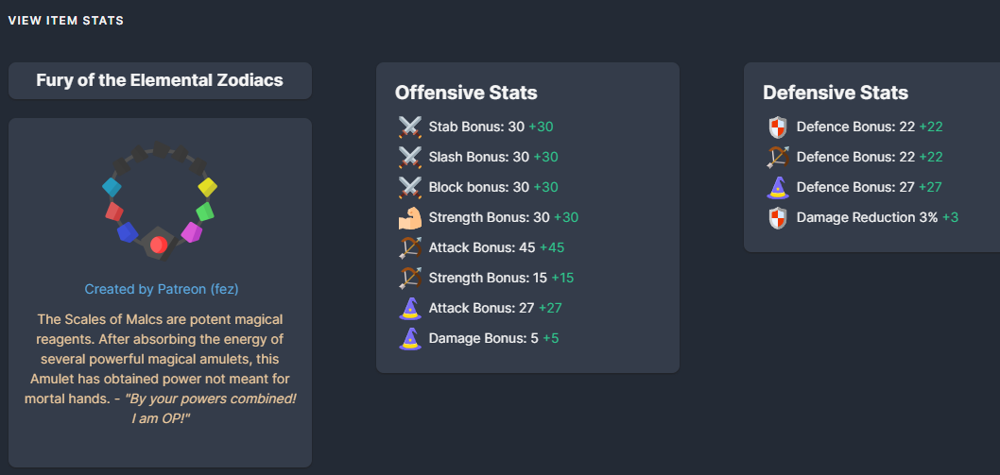

# Item Descriptions Expanded

This mod is a community effort to add item descriptions to all items in the game.



Translations for all descriptions have been gathered through chat-gpt, they may be incorrect.

## Currently Added
- Base Game
  - Amulets
  - Arrows

- TotH
   - Amulets
   - Arrows

## Description Contributors
- TheRealOsamaru

## How to Contribute
Add the `id` and the `expandedDescription` to the relevant expansions json file located in `sec/data`.

From here, add the relevant key/value pair into each of the language translations found in `sec/languages`.

For example.

`src/data/data.json`

```
{
    "id": "melvorD:Bronze_Arrows",
    "expandedDescription": "Common arrows tipped with a Bronze head. Pointy!"
}
```

`src/languages/english.ts`

```
Bronze_Arrows: 'Common arrows tipped with a Bronze head. Pointy!',
```

Repeat this for ALL languages.

## Dependencies
Download and install NodeJS https://nodejs.org/en

The latest LTS version is fine.

### Setup
- Fork this git repo
- Clone your fork locally
- Open the folder in VS Code
- In the terminal run `npm i` to download the required npm packages
- Run `npm run build` to compile the application
- You'll find the zip in the build folder which you can add to the Creator's Toolkit mod for local testing
- Once all your changes are done, commit to your branch, push it to the server and open a pull request from your repo into this repo
- Once the PR has been reviewed, it will get approved which merges into this repo (you can freely delete your fork if you no longer want it)
- At this point, I'll run `npm run build` on my machine and upload the zip to mod.io
